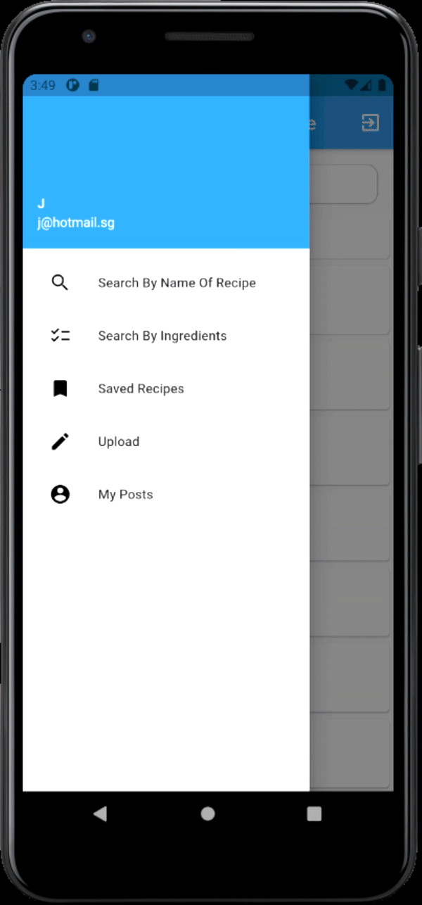

# NUS Orbital Project 2021 - RecipeLeh

  

## Motivation:
In this fast-paced country, most students have both of their parents out in the working field. 
Many would love to learn some culinary skills in order to prepare a meal for themselves or for their family. Especially in this pandemic where most students are having online 
classes, yet would like to save up money instead of the frequent use of food delivery. Many probably would research online for food recipes, however, would face insufficient 
ingredients at home. In order to complete the food recipe, they are required to purchase additional ingredients which would first defeat the purpose of saving money. Hence, an 
application which would allow the users to be able to input the ingredients that they currently have and would display recipes that use the exact ingredients would be beneficial. 
Adding social media functionalities so that the application is more engaging and like-minded people can interact and learn from each other through constructive feedback.

## Tech Stack :computer:
- Flutter-Dart (Front-end)
- Firebase (Back-end)
- Git (Version Control)

## Features
There is a difference in the features provided between the User and Guest account.

<table>
    <tbody>
        <tr>
            <th>Features</th>
            <th>Descriptions</th>
            <th>Users</th>
            <th>Guests</th>
        </tr>
        <tr>
            <td>Login Page</td>
            <td>
                <ul>
                    <li> Users are provided the options to <strong>login with it's crediential</strong> or <strong>sign up an account</strong> or <strong>sign in as a guest</strong> </li>
                </ul>
            </td>
            <td></td>
        </tr>
        <tr>
            <td>Signup Page</td>
            <td>
                <ul>
                    <li>This page allows users to <strong>create their account</strong> with full access to the features provided in this application</li>
                </ul>
            </td>
            <td></td>
        </tr>
        <tr>
            <td>Menu Bar</td>
            <td>
                <ul>
                    <li><strong>Functions available</strong> for users and guests respectively.</li>
                </ul>
            </td>
            <td></td>
            <td></td>
        </tr>
        <tr>
            <td>Search By Recipe</td>
            <td>
                <ul>
                    <li> A <strong>search function that both users and guests are able to input the name of the recipe into the search bar</strong>.</li>
                      <li> The recipes displayed are <strong>sorted by decreasing number of likes</strong>.</li>
                </ul>
            </td>
            <td></td>
        </tr>
        <tr>
            <td>Search By Ingredients</td>
            <td>
                <ul>
                    <li>xxxx</li>
                </ul>
            </td>
            <td></td>
        </tr>
        <tr>
            <td>Upload</td>
            <td>
                <ul>
                    <li>Users are able to <strong>upload their recipes</strong> with the help of hint text provided.</li>
                </ul>
            </td>
            <td></td>
        </tr>
        <tr>
            <td>View Post</td>
            <td>
                <ul>
                    <li>User who uploaded the post would be able to <strong>edit</strong> and <strong>delete</strong> it with icons in the top right corner of the post.</li>
                  <li>Other users are able to <strong>like, comment and save</strong> the post.</li>
                  <li>Guests are <strong>provided only the options to view the post and comments</strong></li>
                </ul>
            </td>
            <td></td>
            <td></td>
        </tr>
        <tr>
            <td>Comment</td>
            <td>
                <ul>
                  <li>Users are able to <strong>view and comment</strong> on the post.</li>
                  <li>Guests are only able to <strong>view the comments<strong>.</li>
                </ul>
            </td>
            <td></td>
            <td></td>
        </tr>
        <tr>
            <td>Saved Recipes</td>
            <td>
                <ul>
                    <li>Users are able to <strong>view all the recipes saved</strong> previously and are <strong>sorted by the most recent saved posts at the top</strong>.</li>
                </ul>
            </td>
            <td></td>
        </tr>
        <tr>
            <td>My Posts</td>
            <td>
                <ul>
                    <li>Users are able to <strong>view all the posts uploaded</strong> by themselves and are <strong>sorted by the most recent posts uploaded at the top</strong></li>
                </ul>
            </td>
            <td></td>
        </tr>
    </tbody>
</table>

<!--
| Features | Descriptions | Users | Guests |
| --- | --- | --- | --- |
| Login Page | - Users are provided the options to **login with it's crediential** or **sign up an account** or **sign in as a guest**. ||
| Signup Page | - This page allows users to **create their account** with full access to the features provided in this application. ||
| Menu Bar | **Functions available** for users and guests respectively. ||
| Search By Recipe | - A **search function that both users and guests are able to input the name of the recipe into the search bar**.   - The recipes displayed are **sorted by decreasing number of likes**. ||
| Search By Ingredients |||
| Upload | - Users are able to **upload their recipes** with the help of hint text provided. ||
| View Post | - User who uploaded the post would be able to **edit** and **delete** it with icons in the top right corner of the post.   Other users are able to **like, comment and save** the post.   - Guests are **provided only the options to view the post and comments**. ||
| Comment | - Users are able to **view and comment** on the post.   - Guests are only able to **view the comments**. ||
| Saved Recipes | - Users are able to **view all the recipes saved** previously and are **sorted by the most recent saved posts at the top**. ||
| My Posts | - Users are able to **view all the posts uploaded** by themselves and are **sorted by the most recent posts uploaded at the top**. ||
-->
## Team Members :busts_in_silhouette:
1. Lee Jia Jun Joseph

2. Wu HanHui
